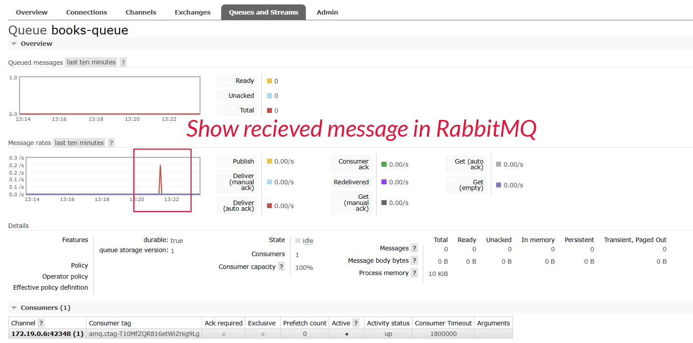

## Description
This is a sample microservices-based Bookstore project that demonstrates a modular and scalable architecture using **NestJS**. It consists of three main services:

- `bookstore-api-gateway` (Consumer) – Acts as the entry point for users, exposing a unified API to interact with the system. It runs on port 3000, connects to the auth service via **TCP**, and communicates with the books service via **RabbitMQ**.

- `auth` (Producer Microservice) – Handles authentication and user management. It issues and verifies **JWT** tokens for secure access.

- `books` (Producer Microservice) – Manages book and author data. It communicates asynchronously using RabbitMQ and requires a valid RabbitMQ URL to operate.

Additionally, a `libs` directory is included to share common contracts and logic across services, promoting code reusability.

This project uses JWT for authentication and **Docker** for infrastructure as code (IaC) to streamline development and deployment.

## Screenshots

<div style="display: flex; flex-direction: column; flex-wrap: wrap;">
    <lable style="margin:0 5px"><strong>Docker compose:</strong></label>
    <br/>
    
    <br/>
    <lable style="margin:25px 5px;"><strong>Docker compose & Logs:</strong></label>
    <br/>
    
    <br/>
    <lable style="margin:25px 5px"><strong>Login:</strong></label>
    <br/>
    
    <br/>
    <lable style="margin:25px 5px"><strong>Create book with authentication header:</strong></label>
    <br/>
    
    <br/>
    <lable style="margin:25px 5px"><strong>Create book:</strong></label>
    <br/>
    
    <br/>
    <lable style="margin:25px 5px"><strong>RabbitMQ:</strong></label>
    <br/>
    
</div>

## Project setup
Create `.env` files with the **following** keys:
- `RABBITMQ_URL`=your_rabbitmq_url  # RabbitMQ queue URL  
- `MONGODB_URI`=your_mongo_db_url
- `BOOKS_QUEUE`=your_books_queue_name  # RabbitMQ queue name  
- `AUTH_PORT`=your_auth_service_port  # TCP port for connecting 
to the Auth service 
- `EXPIRATION_TIME`=expiration time for jwt token
- `TOKEN_SECRET_KEY`=you_token_key for jwt verification 


## Run by docker
```bash
$ docker-compose up
```
## Compile and run the project
run each project seperately and call 
```bash
$ pnpm install
```

```bash
# watch mode
$ nest start app_name --watch #example nest start books --watch
```

## Author Info
[Saman Kefayatpour](https://www.linkedin.com/in/samankefayatpour/)
